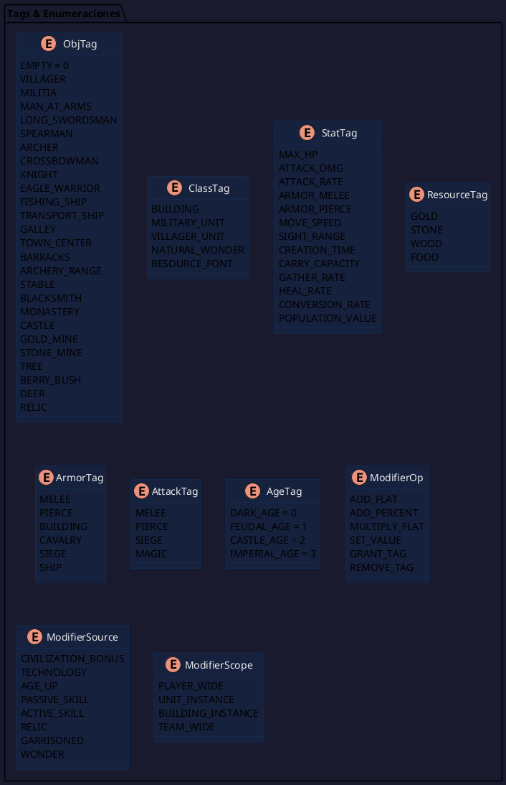
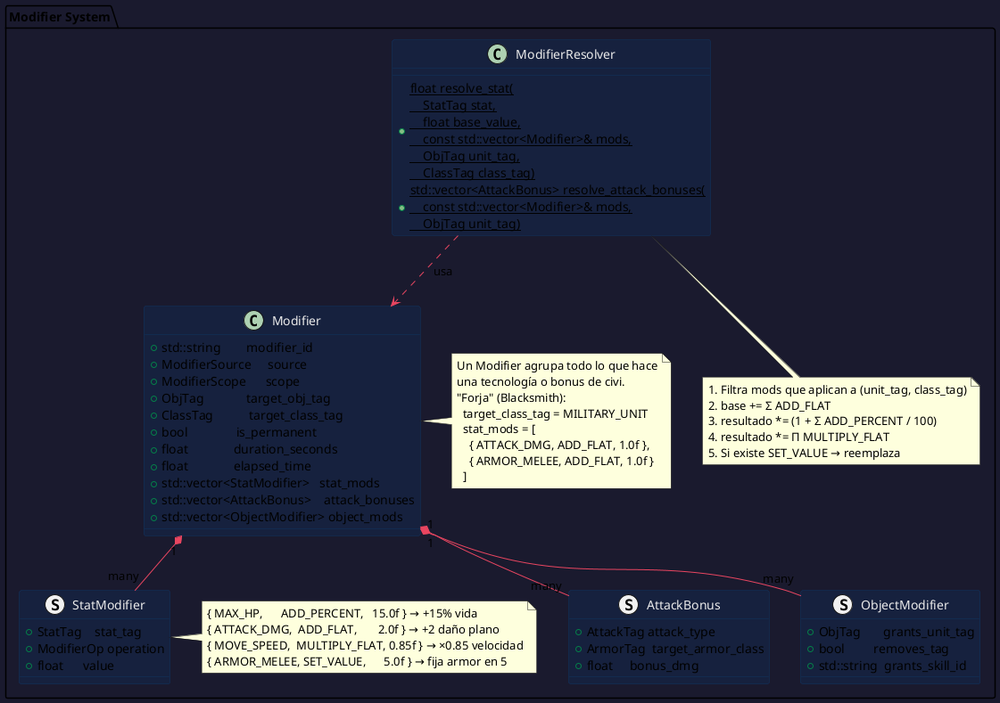
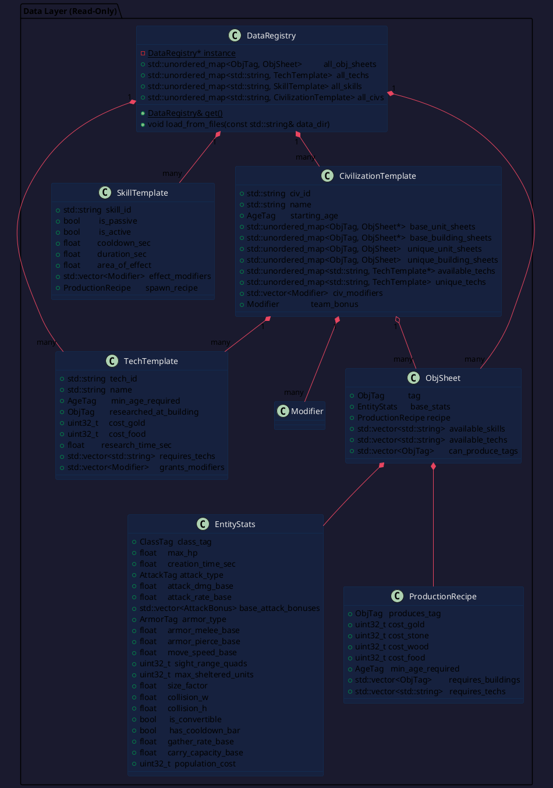
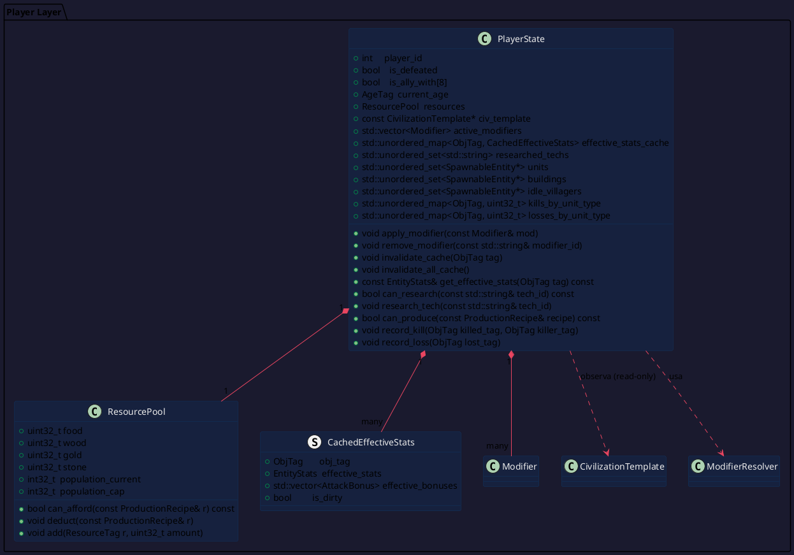
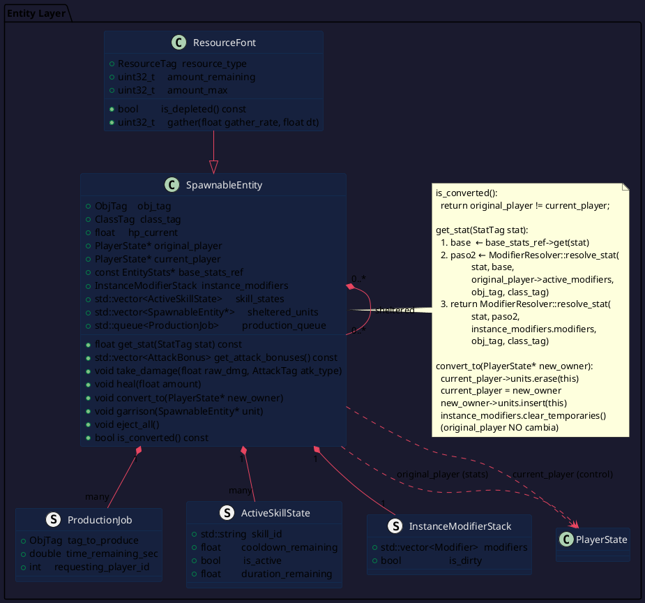
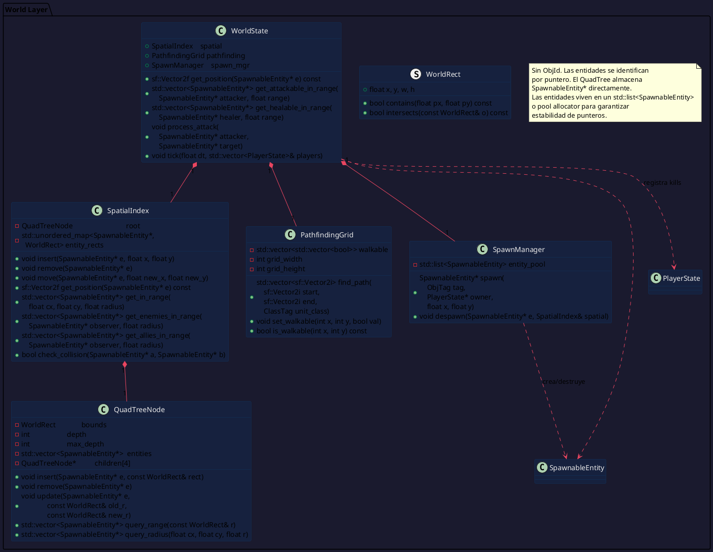
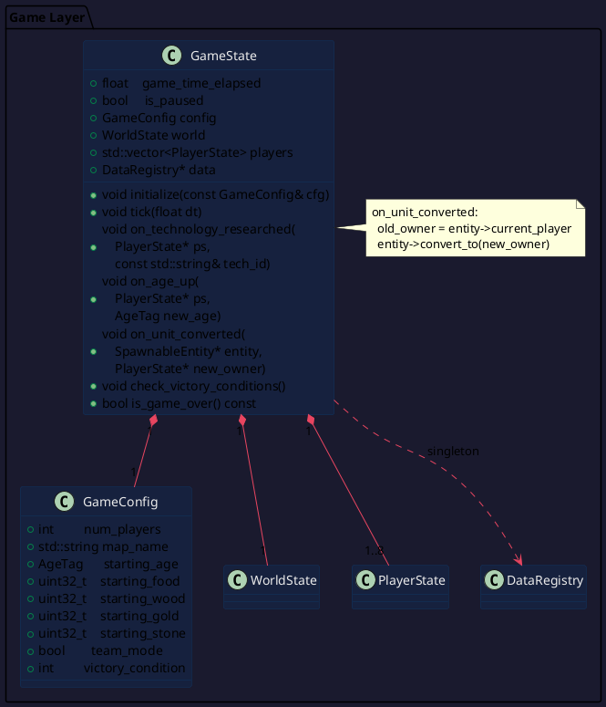
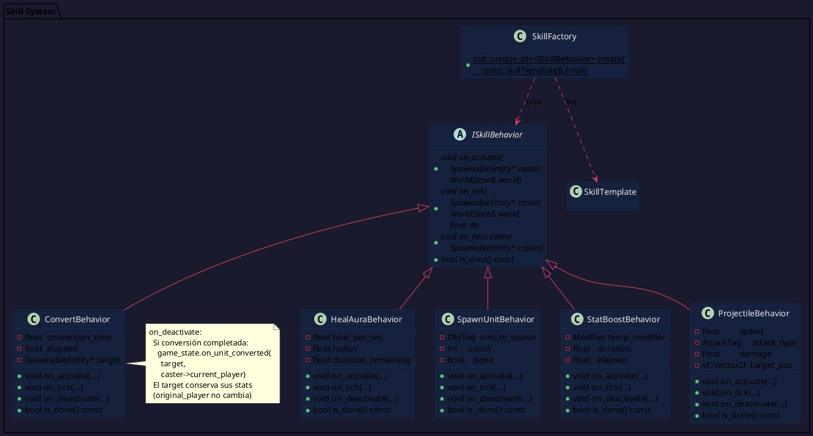
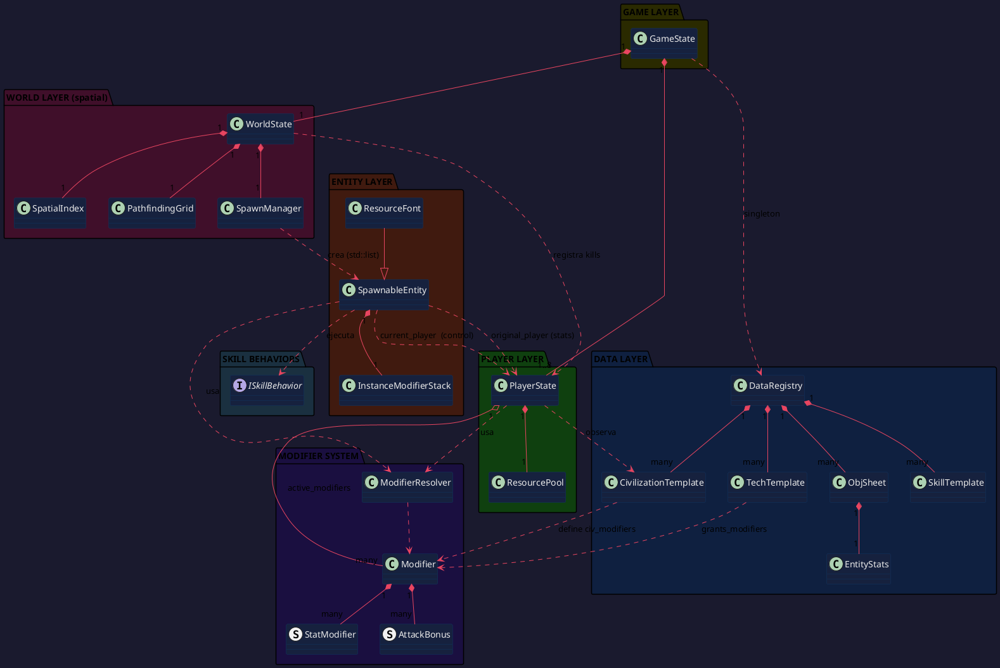

# Arquitectura de Clases — AoE2 Clone (C++ / SFML)
> **v2** — Elimina `ObjId`, sistema de conversión dual-pointer, kill counter por unidad.
> Diagramas PlantUML renderizables en [PlantUML Online](https://www.plantuml.com/plantuml/uml/).

---

## 1. Visión General del Sistema

El juego se divide en **cinco capas ortogonales**. Cada capa solo conoce las capas inferiores a ella:

```
┌──────────────────────────────────────────┐
│  5. RENDER / UI  (SFML, HUD, selección)  │
├──────────────────────────────────────────┤
│  4. GAME LOOP    (GameState, input, dt)  │
├──────────────────────────────────────────┤
│  3. WORLD STATE  (QuadTree, pathfinding, │
│                   colisiones, spawns)    │
├──────────────────────────────────────────┤
│  2. PLAYER STATE (recursos, tecnologías, │
│                   stats efectivos, civis)│
├──────────────────────────────────────────┤
│  1. DATA LAYER   (plantillas estáticas,  │
│                   stats base, recetas)   │
└──────────────────────────────────────────┘
```

La separación fundamental:
- **WorldState** → sabe *dónde* están las cosas (posición, colisión, pathfinding). La búsqueda es **100% espacial**.
- **PlayerState** → sabe *qué tan poderosas* son las cosas (stats, modificadores, recursos). Vive **toda la partida**.
- **SpawnableEntity** → instancia viva que une ambos mundos. Su identidad **es su puntero**, no un ID numérico.

---

## 2. Por Qué ObjId No Tiene Sentido

En un RTS la búsqueda de entidades siempre parte de una posición o de un área:
- _"¿Qué enemigos tengo en rango de ataque?"_ → query espacial por radio
- _"¿Qué hay debajo del cursor?"_ → query espacial por punto
- _"¿Qué unidades de este jugador están vivas?"_ → iterar `PlayerState::units`

Un `ObjId` solo sería útil si necesitaras buscar **por nombre/número** independientemente del espacio, lo cual no ocurre en un RTS. Por eso:

- El `QuadTree` almacena `SpawnableEntity*` directamente.
- `PlayerState` usa `std::unordered_set<SpawnableEntity*>` para sus colecciones.
- La identidad de una entidad **es su dirección de memoria** durante su vida útil.

> **Nota sobre memoria**: Esto requiere que las entidades vivan en memoria estable (no en `std::vector` que se reasigna). Usa `std::list<SpawnableEntity>` o un pool allocator para las entidades. Los punteros seguirán siendo válidos mientras la entidad exista.

---

## 3. El Sistema de Conversión: Dual-Pointer

### 3.1 El Problema

Cuando un Monje convierte un Guerrero Águila azteca para el español, ¿qué stats tiene esa unidad?

**Decisión de diseño**: La unidad convertida **conserva los stats de su creador original**. Un Guerrero Águila azteca trabajando para el español sigue siendo tan fuerte como lo hizo su civi original. Esto tiene sentido lore-wise y evita romper el balance de unidades únicas.

### 3.2 La Solución: Dos Punteros

```cpp
// En SpawnableEntity:
PlayerState* original_player;   // El que creó la unidad. NUNCA cambia.
PlayerState* current_player;    // El dueño actual. Cambia en conversión.
```

| Situación | `original_player` | `current_player` | Stats vienen de |
|---|---|---|---|
| Unidad no convertida | `&player_A` | `&player_A` | `player_A` (son el mismo) |
| Unidad convertida | `&player_A` | `&player_B` | `player_A` (el original) |

La regla es simple: **los stats de una entidad siempre se resuelven contra `original_player`**. El `current_player` solo determina allegiance (quién la controla, a quién aporta población, quién recibe los recursos que recolecta).

### 3.3 Por Qué los PlayerStates Viven Toda la Partida

Si el jugador A es eliminado pero tenía unidades convertidas por el jugador B, esas unidades siguen necesitando el `original_player` de A para resolver sus stats. Por eso los `PlayerState` se destruyen solo al cerrar la partida, no cuando el jugador pierde.

```cpp
// Esto siempre es seguro durante la partida:
float atk = entity->get_stat(ATTACK_DMG);
// Internamente: usa entity->original_player->get_effective_stats(entity->obj_tag)
// Aunque player A esté "derrotado", su PlayerState sigue en memoria con is_defeated=true
```

### 3.4 El Kill Counter

Cada `PlayerState` lleva un registro de cuántas unidades de cada tipo han matado **sus** unidades. Esto sirve para estadísticas, achievements y potencialmente para triggers de misión.

```cpp
// En PlayerState:
std::unordered_map<ObjTag, uint32_t> kills_by_unit_type;
// Ej: kills_by_unit_type[EAGLE_WARRIOR] = 12
// → "mis Guerreros Águila mataron 12 unidades"
```

Si quieres también llevar cuántas **bajas propias** tuvo cada tipo, agregas:
```cpp
std::unordered_map<ObjTag, uint32_t> losses_by_unit_type;
```

---

## 4. El Sistema de Modificadores

### 4.1 Por Qué NO mutar `EntityStats` directamente

Mutar el stat base hace imposible deshacerlo (necesario para hechizos temporales, conversión, etc.) y pierdes la procedencia del cambio.

### 4.2 Base + Lista de Modificadores → Stat Efectivo

```
stat_efectivo = f(stat_base, [mod1, mod2, mod3, ...])
```

El `ModifierResolver` es una **función pura**: recibe el valor base + lista de mods → devuelve el valor final. Nunca muta nada.

### 4.3 Orden de Aplicación (CRÍTICO)

```
1. base + Σ(ADD_FLAT)
2. paso_1 × (1 + Σ(ADD_PERCENT) / 100)
3. paso_2 × Π(MULTIPLY_FLAT)
4. Si existe SET_VALUE → reemplaza todo
```

Este orden garantiza que no importa el orden en que se investiguen las tecnologías, el resultado es el mismo.

### 4.4 Lookup de Stats en una Entidad Convertida

```
entity->get_stat(ATTACK_DMG)
    │
    └─→ usa entity->original_player->get_effective_stats(entity->obj_tag)
              │
              └─→ ModifierResolver::resolve(base_stat, original_player->active_modifiers, obj_tag)
```

Los mods de instancia (hechizos temporales sobre esta unidad específica) se aplican encima:

```
stat_final = resolve(resolve(base, player_mods), instance_mods)
```

---

## 5. Diagramas PlantUML

### Diagrama 1: Enumeraciones y Tags (Data Layer)



---

### Diagrama 2: Sistema de Modificadores



---

### Diagrama 3: Data Layer — Plantillas Estáticas



---

### Diagrama 4: Player State



---

### Diagrama 5: Entidades en el Mundo



---

### Diagrama 6: World State (QuadTree — búsqueda espacial pura)



---

### Diagrama 7: GameState — Orquestador



---

### Diagrama 8: Sistema de Habilidades (Strategy Pattern)



---

### Diagrama 9: Vista Completa de Capas



---

## 6. Flujos Clave

### 6.1 Conversión de una Unidad (Monje)

```
ConvertBehavior::on_deactivate(monje_azteca)
    │
    ├── target = guerrero_aguila_azteca (original_player = &player_azteca)
    ├── Llama GameState::on_unit_converted(target, monje->current_player)
    │       ├── old_owner = target->current_player  (= &player_azteca)
    │       ├── target->convert_to(&player_espanol)
    │       │       ├── current_player->units.erase(target)    // player_azteca lo suelta
    │       │       ├── current_player = &player_espanol
    │       │       ├── current_player->units.insert(target)   // player_espanol lo toma
    │       │       └── limpia instance_modifiers temporales
    │       └── original_player sigue siendo &player_azteca
    │
    └── Resultado: el guerrero pertenece al español
        PERO sus stats siguen calculándose con los mods del azteca
        → Si el azteca tenía "Garland Wars" (+4 ataque), el guerrero convertido
          aún tiene ese bonus aunque el español no haya investigado esa tech.
```

### 6.2 Muerte de una Unidad y Kill Counter

```
WorldState::process_attack(espada_espanol, arquero_mongol)
    │
    ├── raw_dmg = espada->get_stat(ATTACK_DMG)  // usa original_player del español
    ├── armor   = arquero->get_stat(ARMOR_MELEE) // usa original_player del mongol
    ├── net_dmg = raw_dmg - armor
    ├── arquero->take_damage(net_dmg, MELEE)
    │
    └── Si arquero->hp_current <= 0:
            // Kill se atribuye al original_player del atacante
            espada->original_player->record_kill(ARCHER, LONG_SWORDSMAN)
            // Baja se atribuye al current_player de la víctima
            arquero->current_player->record_loss(ARCHER)
            world.despawn(arquero)
```

> **Nota**: Si el `espada_espanol` era originalmente azteca (convertido), el kill se registra en el `PlayerState` azteca original. Decisión a tomar: ¿el kill debe ir al `current_player` (quien controla) o al `original_player` (quien "merece" el crédito)?

### 6.3 Investigar una Tecnología

```
GameState::on_technology_researched(&player_espanol, "tech_forja")
    │
    ├── player_espanol.can_research("tech_forja") → OK
    ├── player_espanol.resources.deduct(tech_forja.recipe)
    ├── Crea Modifier desde TechTemplate::grants_modifiers
    ├── player_espanol.apply_modifier(forja_modifier)
    │       ├── active_modifiers.push_back(forja_modifier)
    │       └── invalidate_cache(MILITIA), invalidate_cache(MAN_AT_ARMS), ...
    └── player_espanol.researched_techs.insert("tech_forja")

Próximo frame: milicia_espanola->get_stat(ATTACK_DMG)
    → resolve(base=4, player_espanol.active_modifiers)
    → 4 + 1 (Forja ADD_FLAT) = 5.0f
    (La milicia azteca convertida NO se beneficia: usa player_azteca.active_modifiers)
```

### 6.4 Subir de Edad

```
GameState::on_age_up(&player_espanol, FEUDAL_AGE)
    │
    ├── Crea Modifier AGE_UP con scope=PLAYER_WIDE
    ├── player_espanol.apply_modifier(feudal_up_modifier)
    ├── Invalida todo el cache del jugador
    └── Desbloquea nuevas entradas en production_queue de edificios
```

---

## 7. Estructura de Archivos Sugerida

```
src/
├── enums/
│   ├── tags.hpp          ← ObjTag, ClassTag, StatTag
│   └── enums.hpp         ← ResourceTag, ArmorTag, AttackTag, AgeTag,
│                            ModifierOp, ModifierSource, ModifierScope
│
├── data/
│   ├── data_registry.hpp/.cpp
│   ├── entity_stats.hpp
│   ├── obj_sheet.hpp
│   ├── tech_template.hpp
│   ├── skill_template.hpp
│   └── civ_template.hpp
│
├── modifiers/
│   ├── modifier.hpp         ← struct Modifier, StatModifier, AttackBonus, ObjectModifier
│   └── modifier_resolver.hpp/.cpp
│
├── player/
│   ├── player_state.hpp/.cpp
│   └── resource_pool.hpp
│
├── entities/
│   ├── spawnable_entity.hpp/.cpp
│   └── resource_font.hpp/.cpp
│
├── skills/
│   ├── i_skill_behavior.hpp
│   ├── skill_factory.hpp/.cpp
│   ├── heal_aura_behavior.hpp/.cpp
│   ├── stat_boost_behavior.hpp/.cpp
│   ├── spawn_unit_behavior.hpp/.cpp
│   ├── convert_behavior.hpp/.cpp
│   └── projectile_behavior.hpp/.cpp
│
├── world/
│   ├── world_state.hpp/.cpp
│   ├── spatial_index.hpp/.cpp    ← QuadTree, búsqueda espacial
│   ├── pathfinding_grid.hpp/.cpp ← A*
│   └── spawn_manager.hpp/.cpp    ← std::list<SpawnableEntity>
│
└── game/
    ├── game_state.hpp/.cpp
    └── game_config.hpp
```

---

## 8. Preguntas Abiertas

1. **Kill counter y conversión**: ¿El kill de una unidad convertida se atribuye a `original_player` (quien la entrenó) o a `current_player` (quien la controla en ese momento)?
2. **Proyectiles**: ¿Son entidades en el `SpawnManager` (tienen puntero, posición en el QuadTree) o efectos puramente visuales sin existencia en el world state?
3. **Formato de datos**: ¿JSON, XML, binario propio, o hardcodeado en C++ como `constexpr`?
4. **Niebla de guerra**: ¿Se implementa en el `WorldState` (filtra queries) o solo en el Render Layer?
5. **Multijugador**: ¿Local o red? Si es red: el `GameState` debe ser 100% determinístico (sin `float` random, sin `std::unordered_map` con orden no determinístico).
