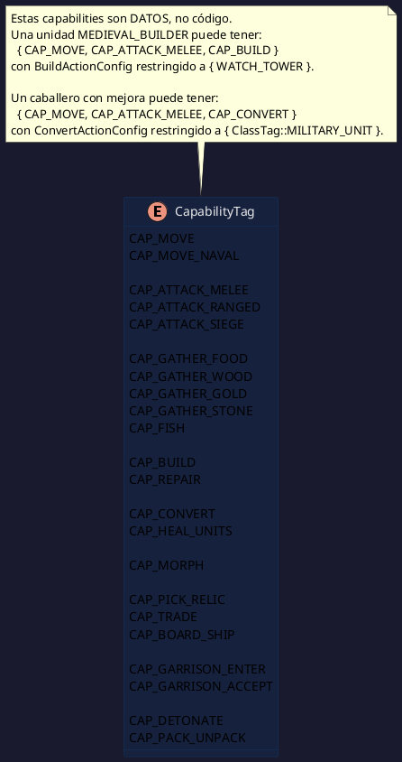
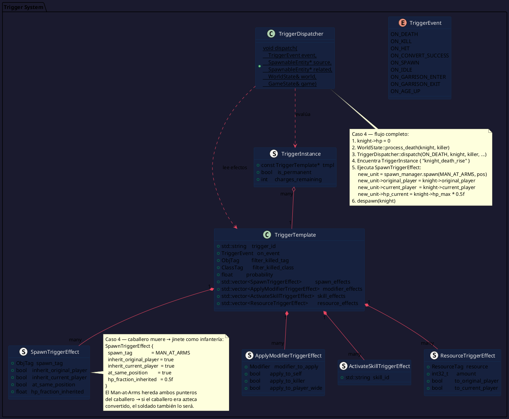
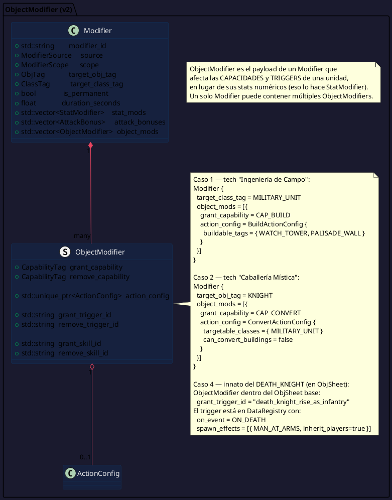
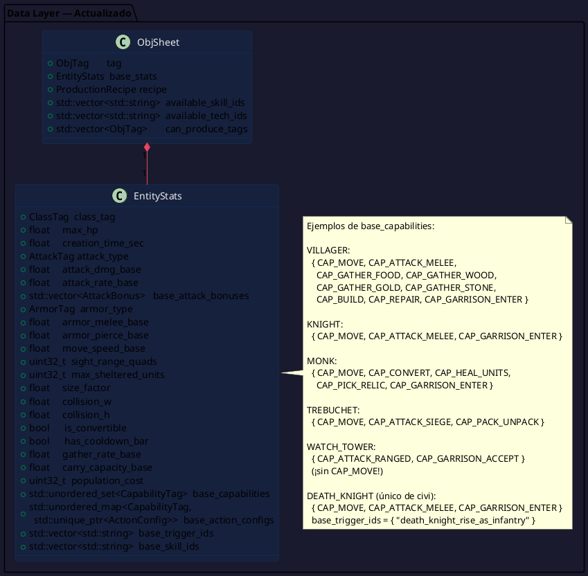
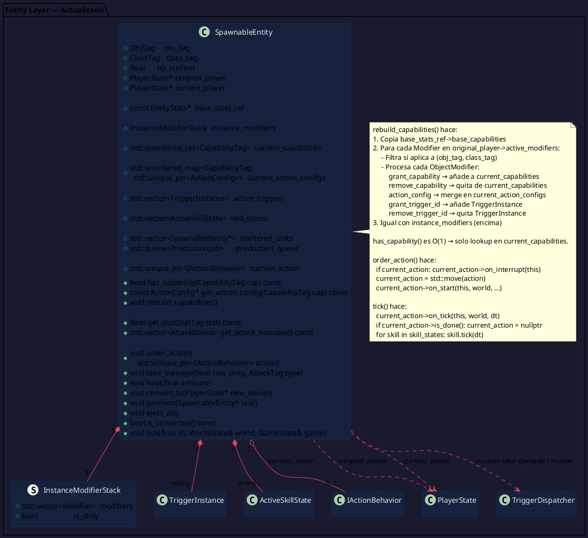
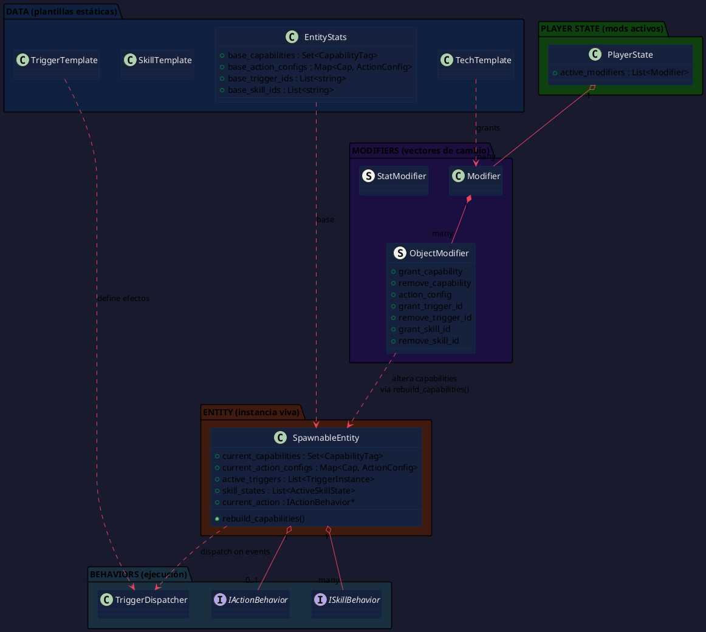

# Sistema de Mutabilidad de Unidades — PlantUML
> Diagrama complementario a `architecture.md`. Solo cubre el sistema de Capabilities + Actions + Triggers.
> La idea central: `ClassTag` describe lo que una unidad **ES**. `CapabilityTag` describe lo que una unidad **PUEDE HACER**. Son ortogonales y los segundos son totalmente dinámicos.

---

## Los 4 Casos de Uso como Guía de Diseño

| # | Caso | Mecanismo |
|---|---|---|
| 1 | Unidad no-aldeano que construye torres | Modifier otorga `CAP_BUILD` con `BuildActionConfig { WATCH_TOWER }` |
| 2 | Caballeros que convierten infantería enemiga | Tech otorga `CAP_CONVERT` con `ConvertActionConfig { target: INFANTRY }` |
| 3 | Unidad del castillo se sacrifica → edificio | Action `CAP_MORPH` con `MorphActionConfig { consume: true, form: TOWER }` |
| 4 | Caballero muere → jinete se levanta como infantería | Trigger `ON_DEATH` con `SpawnTriggerEffect { spawn: MAN_AT_ARMS }` |

---

## Diagrama 1: CapabilityTag — Lo que una unidad puede hacer

---

## Diagrama 2: ActionConfig — La configuración de cada capability

```plantuml
@startuml ActionConfigs
skinparam backgroundColor #1a1a2e
skinparam classBackgroundColor #16213e
skinparam classBorderColor #0f3460
skinparam classArrowColor #e94560
skinparam classFontColor #eaeaea

package "ActionConfig Hierarchy" {

  abstract class ActionConfig {
    + CapabilityTag capability
    + {abstract} ActionConfig* merge(const ActionConfig* other) const
    ' merge() combina dos configs del mismo tipo
    ' (ej: dos BuildActionConfigs se unen sus listas)
  }

  note top of ActionConfig
    Cada CapabilityTag tiene su propia subclase de ActionConfig.
    Se almacenan en un mapa: CapabilityTag → ActionConfig*
    Las subclases definen QUÉ puede hacer la unidad con esa capability.
  end note

  ' ─── Construcción ───────────────────────────────────────
  class BuildActionConfig {
    + std::vector<ObjTag> buildable_tags
    ' Qué edificios puede construir esta unidad.
    ' Vacío = puede construir todo lo del jugador.
    ' { WATCH_TOWER } = solo torres de guardia.
    + ActionConfig* merge(const ActionConfig* other) const
    ' merge: une los dos buildable_tags (union de conjuntos)
  }

  note right of BuildActionConfig
    Caso 1 — "unidad que construye torres":
    Modifier otorga CAP_BUILD con:
      buildable_tags = { WATCH_TOWER }
    Un aldeano tiene:
      buildable_tags = {} (vacío = todo)
  end note

  ' ─── Conversión ─────────────────────────────────────────
  class ConvertActionConfig {
    + std::vector<ClassTag>  targetable_classes
    ' Qué clases puede convertir (vacío = todas).
    + std::vector<ObjTag>    targetable_tags
    ' ObjTags específicos convertibles (vacío = todos de la clase).
    + bool                   can_convert_buildings
    + float                  convert_speed_modifier
    + ActionConfig* merge(const ActionConfig* other) const
    ' merge: une targetable_classes y targetable_tags
  }

  note right of ConvertActionConfig
    Caso 2 — "caballeros que convierten infantería":
    Tech otorga CAP_CONVERT con:
      targetable_classes = { MILITARY_UNIT }
      can_convert_buildings = false
    Solo infantería militar. No edificios.

    Monje base tiene:
      targetable_classes = {} (vacío = todo)
      can_convert_buildings = true
  end note

  ' ─── Transformación / Morfosis ──────────────────────────
  class MorphActionConfig {
    + ObjTag  target_form
    ' En qué se transforma la unidad.
    + bool    consume_original
    ' true  = la unidad original desaparece (sacrificio).
    ' false = la unidad solo cambia de stats (reversible).
    + bool    inherits_hp_percent
    ' Si el nuevo form hereda el % de HP actual.
    + float   cooldown_sec
    + ActionConfig* merge(const ActionConfig* other) const
    ' merge: el último target_form gana (override)
  }

  note right of MorphActionConfig
    Caso 3 — "unidad se sacrifica → edificio":
    Skill activa ejecuta morph:
      target_form      = TOWER
      consume_original = true
      inherits_hp_percent = false
    La unidad desaparece, aparece una torre en su lugar.

    Trebuchet (pack/unpack):
      target_form      = TREBUCHET_PACKED
      consume_original = false  (reversible)
  end note

  ' ─── Curación ───────────────────────────────────────────
  class HealActionConfig {
    + std::vector<ClassTag>  healable_classes
    + float                  heal_range
    + float                  heal_rate_override
    ' 0 = usa HEAL_RATE del stat
    + ActionConfig* merge(const ActionConfig* other) const
  }

  ' ─── Recolección ────────────────────────────────────────
  class GatherActionConfig {
    + std::vector<ResourceTag> gatherable_resources
    ' Vacío = todos. Pescador solo tiene FOOD.
    + float gather_rate_override
    ' 0 = usa GATHER_RATE del stat
    + ActionConfig* merge(const ActionConfig* other) const
  }

  ' ─── Garrisón (aceptar unidades) ────────────────────────
  class GarrisonAcceptConfig {
    + std::vector<ClassTag>  accepted_classes
    + uint32_t               capacity_override
    ' 0 = usa max_sheltered_units del EntityStats
    + float                  arrow_per_unit
    ' Flechas que dispara el edificio por unidad guarecida
    + ActionConfig* merge(const ActionConfig* other) const
  }

  ActionConfig <|-- BuildActionConfig
  ActionConfig <|-- ConvertActionConfig
  ActionConfig <|-- MorphActionConfig
  ActionConfig <|-- HealActionConfig
  ActionConfig <|-- GatherActionConfig
  ActionConfig <|-- GarrisonAcceptConfig
}
@enduml
```

---

## Diagrama 3: IActionBehavior — Strategy para acciones ordenadas

```plantuml
@startuml ActionBehaviors
skinparam backgroundColor #1a1a2e
skinparam classBackgroundColor #16213e
skinparam classBorderColor #0f3460
skinparam classArrowColor #e94560
skinparam classFontColor #eaeaea

package "Action Behavior System (Strategy)" {

  note as Context
    IActionBehavior = acción que el JUGADOR ordena ("build here", "attack that", "convert").
    ISkillBehavior  = habilidad con cooldown que se ACTIVA.
    Son distintas: un monje usa IActionBehavior para convertir (la ordenas)
    pero usa ISkillBehavior si tiene una habilidad especial de área.
  end note

  abstract class IActionBehavior {
    + CapabilityTag required_capability
    + {abstract} bool can_execute(\n    const SpawnableEntity* actor,\n    const WorldState& world) const
    + {abstract} void on_start(\n    SpawnableEntity* actor,\n    WorldState& world,\n    sf::Vector2f target_pos,\n    SpawnableEntity* target_entity)
    + {abstract} void on_tick(\n    SpawnableEntity* actor,\n    WorldState& world,\n    float dt)
    + {abstract} void on_interrupt(\n    SpawnableEntity* actor)
    + {abstract} bool is_done() const
  }

  class AttackActionBehavior {
    ' Requiere: CAP_ATTACK_MELEE o CAP_ATTACK_RANGED
    - SpawnableEntity* target
    - float            attack_cooldown_remaining
    + bool can_execute(...) const
    + void on_start(...)
    + void on_tick(...)
    + void on_interrupt(...)
    + bool is_done() const
  }

  class BuildActionBehavior {
    ' Requiere: CAP_BUILD
    ' Respeta BuildActionConfig::buildable_tags
    - ObjTag         building_to_place
    - sf::Vector2f   build_target_pos
    - float          build_progress
    - SpawnableEntity* construction_site
    + bool can_execute(...) const
    ' Verifica que building_to_place esté en BuildActionConfig
    + void on_start(...)
    + void on_tick(...)
    ' Avanza build_progress hasta completion_time del edificio
    + void on_interrupt(...)
    + bool is_done() const
  }

  class ConvertActionBehavior {
    ' Requiere: CAP_CONVERT
    ' Respeta ConvertActionConfig::targetable_classes y targetable_tags
    - SpawnableEntity* target
    - float            convert_elapsed
    - bool             interrupted
    + bool can_execute(...) const
    ' Verifica que el target cumpla ConvertActionConfig
    + void on_start(...)
    + void on_tick(...)
    ' Se interrumpe si el monje/caballero recibe daño
    + void on_interrupt(...)
    + bool is_done() const
  }

  class MorphActionBehavior {
    ' Requiere: CAP_MORPH
    ' Lee MorphActionConfig del actor
    - bool done
    + bool can_execute(...) const
    + void on_start(...)
    ' Ejecuta el morph:
    '   Si consume_original: despawn actor, spawn target_form
    '   Si no: cambia base_stats_ref al nuevo ObjSheet
    + void on_tick(...)
    + void on_interrupt(...)
    + bool is_done() const
  }

  note right of MorphActionBehavior
    Caso 3 — unidad castillo → torre:
    actor->get_action_config(CAP_MORPH)
      → MorphActionConfig { TOWER, consume_original=true }
    on_start:
      nueva_torre = world.spawn_manager.spawn(TOWER,
                     actor->original_player,
                     actor_pos)
      world.spawn_manager.despawn(actor)
    La unidad desaparece, aparece la torre.
  end note

  class GatherActionBehavior {
    ' Requiere: CAP_GATHER_*
    - ResourceFont* resource_target
    - float         carry_current
    + bool can_execute(...) const
    + void on_start(...)
    + void on_tick(...)
    + void on_interrupt(...)
    + bool is_done() const
  }

  class HealActionBehavior {
    ' Requiere: CAP_HEAL_UNITS
    - SpawnableEntity* target
    - float            heal_cooldown
    + bool can_execute(...) const
    + void on_start(...)
    + void on_tick(...)
    + void on_interrupt(...)
    + bool is_done() const
  }

  class MoveActionBehavior {
    ' Requiere: CAP_MOVE o CAP_MOVE_NAVAL
    - std::vector<sf::Vector2i> path
    - int                       path_index
    + bool can_execute(...) const
    + void on_start(...)
    ' Solicita path al PathfindingGrid
    + void on_tick(...)
    + void on_interrupt(...)
    + bool is_done() const
  }

  class ActionFactory {
    + {static} std::unique_ptr<IActionBehavior> create(\n    CapabilityTag cap)
  }

  IActionBehavior <|-- AttackActionBehavior
  IActionBehavior <|-- BuildActionBehavior
  IActionBehavior <|-- ConvertActionBehavior
  IActionBehavior <|-- MorphActionBehavior
  IActionBehavior <|-- GatherActionBehavior
  IActionBehavior <|-- HealActionBehavior
  IActionBehavior <|-- MoveActionBehavior
  ActionFactory ..> IActionBehavior : crea
}
@enduml
```

---

## Diagrama 4: TriggerSystem — Reacciones pasivas a eventos

---

## Diagrama 5: ObjectModifier actualizado — Otorgar y quitar capabilities y triggers

---

## Diagrama 6: EntityStats y ObjSheet actualizados — Capabilities base

---

## Diagrama 7: SpawnableEntity actualizado — Capabilities dinámicas

---

## Diagrama 8: Los 4 casos de uso en acción

```plantuml
@startuml UseCases
skinparam backgroundColor #1a1a2e
skinparam classBackgroundColor #16213e
skinparam classBorderColor #0f3460
skinparam classArrowColor #e94560
skinparam classFontColor #eaeaea
skinparam noteBackgroundColor #0f3460

package "Caso 1 — Unidad que construye torres (no aldeano)" #0f2040 {
  note as C1
    **Tech: "Ingeniería de Campo"**
    Researched at: BARRACKS (feudal age)
    grants Modifier {
      target_class_tag = MILITARY_UNIT
      object_mods = [ObjectModifier {
        grant_capability  = CAP_BUILD
        action_config     = BuildActionConfig {
                              buildable_tags = { WATCH_TOWER }
                            }
      }]
    }

    Resultado:
    ► Toda unidad militar del jugador:
        current_capabilities.contains(CAP_BUILD) == true
        get_action_config(CAP_BUILD)
          → BuildActionConfig { buildable_tags = {WATCH_TOWER} }

    ► Jugador selecciona infantería → icono "Construir"
        Si el jugador tiene un aldeano Y un guerrero seleccionados
        y ordena construir una torre:
          - aldeano: usa BuildActionBehavior,
                     can_execute() → buildable_tags vacío = todo ✓
          - guerrero: usa BuildActionBehavior,
                      can_execute() → WATCH_TOWER en su config ✓
          - guerrero no puede construir BARRACKS:
                      can_execute() → BARRACKS no en buildable_tags ✗
  end note
}

package "Caso 2 — Caballeros que convierten infantería" #1a0f40 {
  note as C2
    **Tech: "Caballería Mística"** (unique tech del Castillo)
    grants Modifier {
      target_obj_tag = KNIGHT  (solo caballeros)
      object_mods = [ObjectModifier {
        grant_capability  = CAP_CONVERT
        action_config     = ConvertActionConfig {
                              targetable_classes = { MILITARY_UNIT }
                              can_convert_buildings = false
                              convert_speed_modifier = 0.5f
                            }
      }]
    }

    Resultado:
    ► Solo los KNIGHT del jugador:
        current_capabilities.contains(CAP_CONVERT) == true
        get_action_config(CAP_CONVERT)
          → ConvertActionConfig { MILITARY_UNIT, no buildings, 0.5x speed }

    ► MONK del mismo jugador sigue con su ConvertActionConfig base:
        targetable_classes = {} (vacío = todo)
        can_convert_buildings = true
        (los modifiers solo aplican a KNIGHT por target_obj_tag)

    ► Knight intenta convertir un TREBUCHET (siege weapon):
        ConvertActionBehavior::can_execute():
          target->class_tag == SIEGE_WEAPON
          SIEGE_WEAPON no está en targetable_classes → ✗ cancelado
  end note
}

package "Caso 3 — Unidad se sacrifica → edificio" #401a0f {
  note as C3
    **ObjSheet: RITUAL_WARRIOR** (unique unit del Castillo)
    EntityStats::base_capabilities = {
      CAP_MOVE, CAP_ATTACK_MELEE, CAP_MORPH
    }
    base_action_configs[CAP_MORPH] = MorphActionConfig {
      target_form      = RITUAL_TOWER
      consume_original = true
      inherits_hp_percent = false
    }

    También tiene skill activa "Ritual del Sacrificio":
    → Cuando el jugador la activa, ejecuta:
    SkillBehavior (MorphSkillBehavior):
      1. Verifica actor->has_capability(CAP_MORPH) → true
      2. Lee actor->get_action_config(CAP_MORPH)
             → MorphActionConfig { RITUAL_TOWER, consume=true }
      3. pos = world.spatial.get_position(actor)
      4. nueva_torre = spawn_manager.spawn(RITUAL_TOWER,
                         actor->original_player, pos)
      5. spawn_manager.despawn(actor)

    ► Sin la tech "Ingeniería de Campo" un guerrero normal
      NO tiene CAP_MORPH, así que la skill no aplica a él.
    ► Solo el RITUAL_WARRIOR tiene esta capability en su base.
  end note
}

package "Caso 4 — Caballero muere → jinete se levanta" #0f400f {
  note as C4
    **ObjSheet: DEATH_KNIGHT** (unique unit)
    EntityStats::base_capabilities = {
      CAP_MOVE, CAP_ATTACK_MELEE, CAP_GARRISON_ENTER
    }
    base_trigger_ids = { "death_knight_rise_as_infantry" }

    **TriggerTemplate en DataRegistry:**
    TriggerTemplate {
      trigger_id    = "death_knight_rise_as_infantry"
      on_event      = ON_DEATH
      probability   = 1.0f
      spawn_effects = [SpawnTriggerEffect {
        spawn_tag               = MAN_AT_ARMS
        inherit_original_player = true
        inherit_current_player  = true
        at_same_position        = true
        hp_fraction_inherited   = 0.5f
      }]
    }

    **Flujo en GameState::tick():**
    1. dk->hp_current -= net_damage → llega a 0
    2. WorldState::process_death(dk, killer)
    3. TriggerDispatcher::dispatch(ON_DEATH, dk, killer, world, game)
    4. Itera dk->active_triggers:
         TriggerInstance { "death_knight_rise_as_infantry", charges=-1 }
         on_event == ON_DEATH → dispara
    5. Ejecuta SpawnTriggerEffect:
         new_unit = spawn_manager.spawn(MAN_AT_ARMS, dk_pos)
         new_unit->original_player = dk->original_player
         new_unit->current_player  = dk->current_player
         new_unit->hp_current = new_unit->base_stats->max_hp * 0.5f
         new_unit->rebuild_capabilities()
    6. spawn_manager.despawn(dk)

    ► Si el Death Knight había sido convertido:
         original_player = &azteca, current_player = &espanol
         → El nuevo Man-at-Arms también es azteca-convertido-espanol
         → Sus stats son del azteca, su allegiance es española
  end note
}
@enduml
```

---

## Diagrama 9: Vista completa del sistema de mutabilidad

